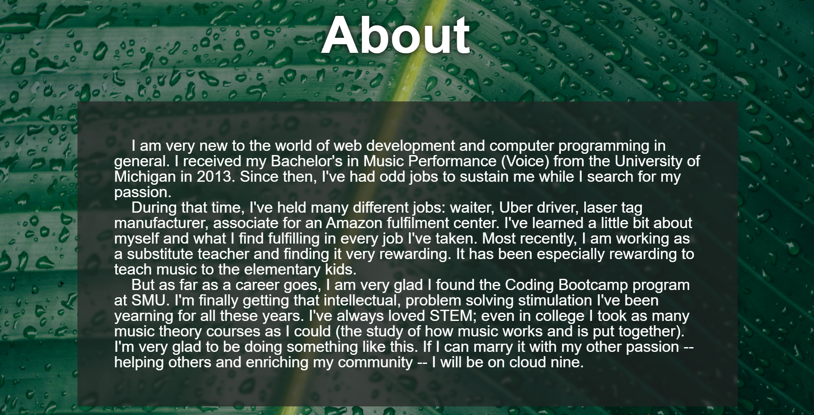
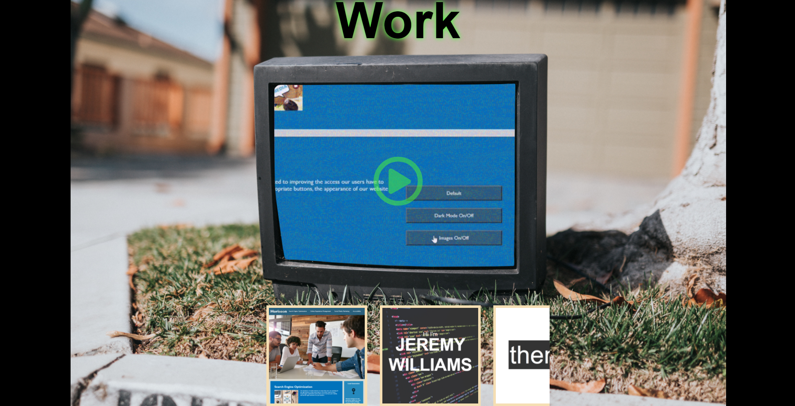
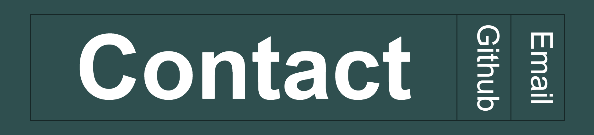

# portfolio

## Intro
This was an exciting project. I was tasked with creating a personal website to host the work I've done so far. It required the following:

* A picture of me
* My name
* A nav bar with links to
    * An About section
    * A section with all my work in it
    * A section with my contact information

The work section had to include links to my work that were titled and which had images. They also had the exciting requirement that the first link had to be bigger than the others. This gave me an idea, but more on that later.

## My Process
So this was going to be a big project. Or at least compared to the work I've done previously. I had zero experience creating an entire website from scratch. Fortunately, my instructors gave me the wonderful advice of creating a wireframe to get me started. Here is a picture of my wireframe:

Oh that's right, I completely threw that excelent advice out the window and jumped right in. This was a huge mistake, and it became obvious very quickly. At least I had the good sense to fall back to this concept later in my build, but agian, more on that later.

But to start, as I said, I just jumped right in. So join me as I just right into this README

### Header

Okay, so the reason I thought I could get away without a wireframe was because honestly a lot of the site didn't need one. I slapped a picture up there with my name and links labeled "About, Work, Contact" that linked to their respective sections. I picked a horrible color scheme I later swapped for the one you see here, and eventually came back to make it responsive to mobile screen sizes. No big worry.

### About

This was also straight forward, and it is at this point that I should point out that both my About section and my Header were largely fleshed out near the beginning of my project and touched up as I pulled my hair out working on my Work section. But again, more on that later . . .
I wanted to try something edgier or more creative than just slapping "ABOUT" at the top of a paragraph, but I honestly couldn't think of that much to do with this section. I wanted to use an image for the background, and so I figured out how to get the background of my paragraph to blur what's behind it in .css, and I think the end result was rather nice. Again, I went back and made sure it was responsive to mobile screen sizes whenever I needed a break from certain other sections.

### Work

Work works. And as I sit here deciding if my tears are from joy or pain, I can find consolation in that at least. This was, without a doubt, the section I spent the most time and energy on. So the instructions said I needed cards with images and titles that when you clicked them you were taken to the sites I've worked on. It also said the first image needed to be larger than the others. Well that instantly made me think of a side display featuring the highlighted site. Well that made me think that if I select another site, that one should become featured. And well, if we're blowing up the image, it would be lame to just have a bigger copy of the same image. What if instead it moved. Okay, so we just show a gif of the site. This is where I should have stopped. 

That is already quite a lot of new and very cool stuff for me to play with. But no. "Well if the images are moving," my brain says, "What if instead of a boring old border, we get an image of a TV to put it in? That would look cool." You're not wrong, brain, you're just evil. So I set about finding a free image online of a TV. When I found one that suited my needs, I took it over to GIMP, painstakingly cut out the screen, and uploaded that image as the background of the section. (I tried having it be in its own div so I could give it an alt= tag. I really did. But choosing to make it the background was a decision required by my sanity.) 

Great, we're basically half way there. All I need to do is land an image of my site dead in the middle of that screen, no matter how big or small the viewport is, and then land a link on top of that screen that takes you to the site. And then do that for every site. And then find JS that will make the selected site's image and link appear and the other sites disappear. I literally cannot go into all the pixel pushing, trial and error, and torment I went through getting this to work because I think my brain erased much of it in self defense. BUT IT WORKS! And can you guess how I got it to work? By making a drawing with dimensions of the TV screen. How small its width would get before I snap it to a different size. Measurements of where the screen would be after resizing and how wide it would be. By the end I had this framework with what looked like wires all over it for all the dimensions. It really saved me a lot of time. They should give it a catchy name, like, framewiring. Hmm... I'll have to work on it.

I actually did learn a lot from developing this section. There were a lot of weird things about z-indices that I had to navigate (I still don't understand why setting my section to sticky ruins my z-indices), and I also picked up quite a few useful trick for landing things dead center of a page. Would I do it agian? Probably. It's really cool. I like how I got some static behind my gifs and set them to .9 opacity to give them a grainy look. I like the glowing radioactive green I gave to the cards when they're hovered over. There's a LOT I am really proud of. But there are alos so many things I didn't have time for or just couldn't figure out. For one, landing my image on the TV screen required keeping the screen size and placement static. That was a trick in itself, but I really wish I knew more to make the postions and sizes more dynamic. I also never got to styling the scroll bar for the cards. I had really grand ideas about having floating buttons on either side, or having an effect where they get bigger and look like they're floating in the middle. That was all tossed to meet deadlines. It just means I have more fun things to do to this site when I get some free time.

### Contact

This was deceptively simple. I did minimal styling to it, leaving it looking rather basic at first glance. But to get it to work and look the way I wanted without JS required a sneaky trick. I wanted the hovered option to grow and the others to shink. But that would mean referencing a sibling above what you're hovering over to collapse it. This is impossible presently. The solution? Turn it uspide down in HTML and then turn it backward in flex-direction. That way, hovering on GitHub or Email collapses Contact when you hover over them. It can reference itself, so it can grow. And when you're not hovering on either of those, Contact jumps back to its default position of grown. Again, I wish I had more time to play with this. The transition looks very goofy, growing and translating at the same time. But this was the last thing I got done on the site, and that deadline was racing toward me. 

## Conclusion

Okay, one big thing I have to get off my chest is how short I fell on accessibility on this assignment. I hit the easy ones like rhetorical HTML elements and alt= tags, but I couldn't put alt= tags on my background images. I also failed MISERABLY to make this site accessible to people with autism. The interface for the TV is very un-intuitive, and the composition is very cluttered and loud. But all in all, I'm proud of what I accomplished. The Work section looks really cool I think. There are some places I could improve mobile compatibility, but I largely succeeded at that too. I learned a lot, and I'm very excited to show this to my family and friends.
